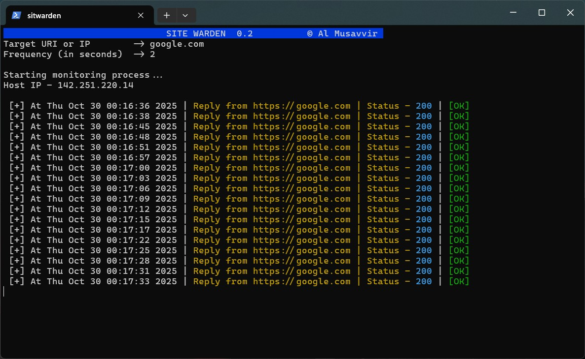

# 🛡️ Sitewarden

[](https://www.python.org/)
[](LICENSE)
[]()
[]()

**Sitewarden** is a lightweight Python-based tool for monitoring the availability, response time, and health of websites or APIs.  
It helps developers, sysadmins, and businesses keep track of uptime, detect outages early, and gain insights into performance trends.




---

## 🚀 Features

- 🔍 **URL Monitoring:** Check one or multiple URLs at defined intervals  
- ⏱️ **Response Time Tracking:** Measure and log latency  
- ⚠️ **Alerting System:** Notify via email, Slack, or console when sites go down  
- 📊 **Logging & Reports:** Export results to CSV, JSON, or databases  
- 🧠 **Smart Retries:** Recheck failed endpoints to avoid false alarms  
- 🧩 **Extensible:** Easily integrate new alerting or logging backends  

---

## 🧰 Installation

```bash
# Clone the repository
git clone https://github.com/almusavvir/sitewarden.git
cd sitewarden

# Install dependencies
pip install -r requirements.txt

# Run Sitewarden
python3 sitewarden.py
